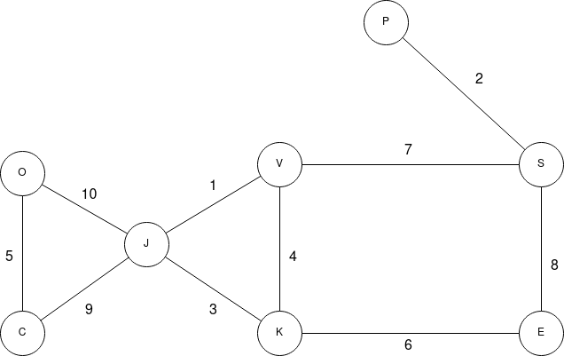
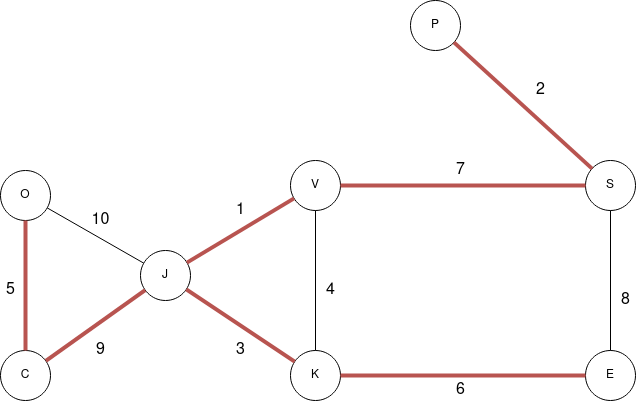

# Prøveeksamen 2019 oppgave 3

### 3a

Her kan vi bruke både DFS og BFS for å avgjøre om grafen er en sammenhengende komponent. Siden DFS og BFS reiser til så mange noder de klarer ved å reise over kanter, vet vi at dersom vi når alle nodene, er grafen sammenhengende, hvis ikke så er grafen ikke sammenhengende. Kjøretid på denne algoritmen er `O(|V| + |E|)`

### 3b

I teorien så kunne vi innført 1 mellomagent som har en kant til alle andre agenter, slik at enhver agent kan kommunisere til enhver annen agent, via denne mellomagenten.

### 3c

For å legge til så få kanter som mulig er vi nødt til å kun legge til 1 kant som forbinder 2 komponenter i grafen, slik at de blir 1 komponent. Vi kan altså igjen kjøre et DFS/BFS søk slik at vi finner alle komponentene i grafen, og legge til en kant mellom to tilfeldige noder i 2 komponenter, helt til vi sitter igjen med 1 stor komponent.

### 3d

Dette er en oppgave om minimale spenntrær. Vi vil velge ut en delmengde av alle kantene som har en lavest mulig risiko (vekt), men fortsatt kobler sammen alle agenter. Dette er et minimalt spenntre. Vi kan altså velge en av algoritmene vi har sett på i pensum:

* Prim's
* Kruskal's
* Boruvka's

Alle finner et minimalt spenntre og alle tre vil fungere. Det er ikke sikkert at de finner nøyaktig samme spenntre, siden det kan være flere gyldige minimale spenntrær hvis grafen har kanter med like vekter.

### 3e

Denne grafen ser slik ut:

Hvis vi bruker en av algoritmene for å finne et minimalt spenntre, for eksempel Kruskal's ville vi valgt disse kantene (rødt)

Merk at i denne grafen er alle vekter unike, så det finnes bare et unikt minimalt spenntre i denne grafen.

### 3f

Denne algoritmen har vi ikke gått gjennom enda i uke 6, men her har vi altså lyst til å avgjøre om grafen inneholder "kritiske noder" (articulation points). Ved å bruke algoritmen som vi skal se på neste uke, så kan man finne disse punktene.

### 3g

[Løsningsforslag](proveeksamen3g.py)

Ideen her er å gjøre en traversering ut fra Oscar og reise bare via ordre-kanal kanter. Når vi kommer til en node sjekker vi alle dens kanter, og hvis det finnes en annen orde-kanal ut fra denne noden (utenom den som vi kom fra) så er dette en ordrekritisk node. Dette er fordi vi vet at ordre-kanaler er et spenntre, så det er egentlig bare løvnoder i dette treet som ikke er ordrekritiske noder, utenom Oscar.

Denne algoritmen er kun en traversering av et spenntre, så dette er `O(|V| + |E|)`. Vi traverserer jo egentlig bare spenntreet, men siden vi må sjekke over alle kanter for å finne ordre-kantene, er vi fortsatt nødt til å gå over alle kanter. Hvis vi bare hadde hatt spenntreet, så vet vi at `|E| = |V|-1` og da hadde kompleksiteten vært `O(|V| + |V| - 1)` = `O(2|V|)` = `O(|V|)`.
