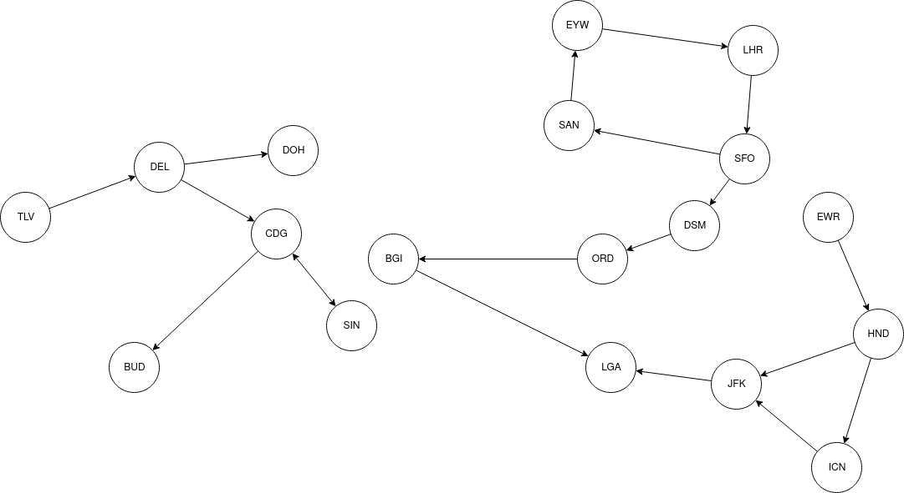

# Uke 7

### Plan

* Bikonnektivitet og kritiske noder algoritme
* Sterkt-sammenhengende komponenter (SCC, Tarjan's algoritme)
* Jobbe med oblig 2 / andre oppgaver

### Oppgaver

##### Flyplass

Se for deg en graf bestående av flyplasser, og flyruter mellom dem. Vi kan si at det går en kant fra flyplass A til flyplass B hvis det går et fly fra A til B, men ikke nødvendigvis motsatt vei. Du er en ny flyplass som naturligvis vil at passasjerene dine skal kunne reise til så mange steder som mulig, men samtidig har du lyst til å minimere hvor mange ruter du er nødt til å opprette. Lag en algoritme som finner hvilke ruter du minimalt må legge til for at det skal være mulig å reise fra den nye flyplassen, til enhver annen flyplass. Det har ingenting å si hvor mange mellomstopp passasjerene må gjennom for å komme til en annen flyplass, det må bare være mulig. Du trenger ikke å tenke på at man må kunne reise tilbake igjen til den nye flyplassen.

Eksempelgraf:

Du er her flyplassen LGA og skal finne det minimale antallet kanter du må legge til for å kunne nå alle andre flyplasser. Svaret på denne grafen er 3 kanter, for eksempel kantene:

* (LGA, EYW)
* (LGA, EWR)
* (LGA, TLV)

Det er ofte flere gyldige svar på denne oppgaven, så algoritmen din trenger ikke gi nøyaktig dette svaret for denne flyplassen.
